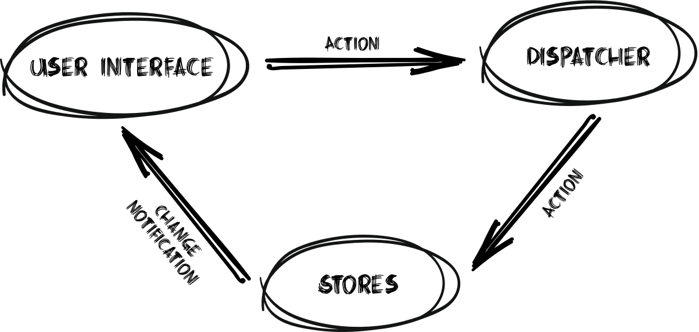
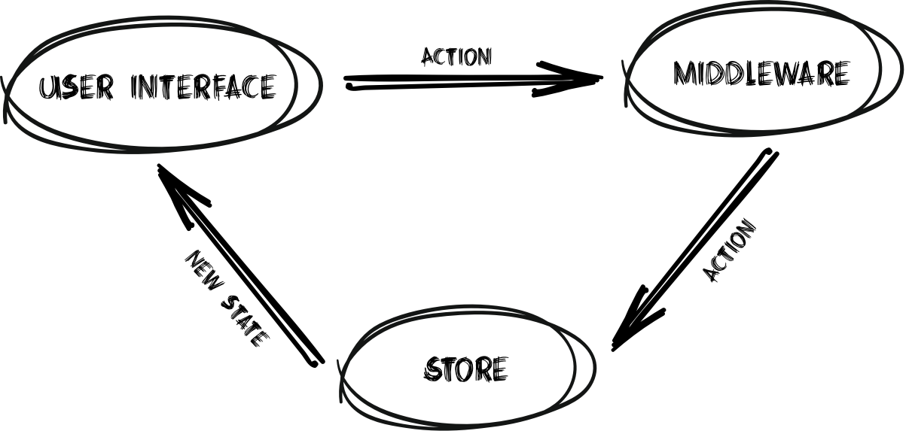

## <a name="part-1">Часть 1. Введение в Redux</a>

## <a name="Сharapter-1">Глава 1. Основные понятия Flux и Redux</a>

Пенициллин, рентген и кардиостимулятор являются известными примерами [непреднамеренных открытий](http://www.businessinsider.com/these-10-inventions-were-made-by-mistake-2010-11?op=1&IR=T). Redux, так же, не должен был стать библиотекой, но оказался отличной реализацией Flux. В мае 2015 года, один из его авторов, [Dan Abramov](https://survivejs.com/blog/redux-interview/), выступал на конференции ReactEurope с докладом "hot reloading and time travel". Он признает, что в тот момент понятия не имел, как осуществить time travel. С некоторой помощью [Andrew Clark](https://twitter.com/acdlite) и вдохновленный некоторыми изящными идеями из языка [Elm](http://elm-lang.org/), Dan, в конце концов, придумал очень приятную архитектуру. Когда люди начали понимать это, он принял решение распространять её как библиотеку.

Менее чем за пол года эта маленькая (всего лишь 2KB) библиотека стала основной для React разработчиков, в связи с её крохотным размером, легко читаемым кодом и очень простыми, но аккуратными идеями, с которыми было намного легче справиться, чем с конкурирующей реализаций Flux. Фактически, Redux не является Flux библиотекой, хотя она развилась от идей архитектуры Flux в Facebook. Официальное определение [Redux](https://redux.js.org/) - "_Предсказуемый контейнер состояния для JavaScript приложений_". Это простая идея, которая означает, что вы сохраняете все состояние своего приложения в одном месте и можете узнать какое состояние находится у приложения в данный момент времени.

### <a name="What-Is-Flux">Что такое Flux?</a>

Перед погружением в Redux мы должны ознакомиться с его базой и предшественником - _Flux архитектурой_. "Flux" - это общая архитектура или паттерн, а не конкретная реализация. Эти идеи были впервые представлены публично Bill Fisher и Jing Chen на конференции Facebook F8 в апреле 2014 года. Flux описывали как переопределение предыдущих идей MVC (Mode-View-Model) и MVVM (Model-View-View-Model) паттернов двусторонней привязки данных, применяемых в других фреймворках. Он предлогал новый паттерн потока событий на frontend стороне - _однонаправленный поток данных._

События во Flux регулируются по одному за раз в круговом потоке с рядом участников: dispatcher, stores, и actions. _Action_ - это структура, описывающая любые изменения в системе: клик мышью, события таймера, Ajax запрос и другие. Action'ы передаются в _dispatcher_ - единственное место в системе, где кто-угодно может отправить action на обработку. Состояние приложения затем сохраняется в _stores_, которые содержат части состояния приложения, и реагируют на команды из dispatcher

Это простейший Flux поток:
1. Stores подписываются на подмножество действий.
2. Action отправляется в dispatcher.
3. Dispatcher уведомляет подписанные stores о action.
4. Stores обновляют свое состояние, основываясь на action.
5. Отображаемый контент обновляется в соответствии с новым состоянием в stores.
6. Можно обрабатывать следующий action.



Этот поток обеспечивает легкое понимание того, как actions протекают в системе, что будет причиной изменения состояния и как оно изменится.

Рассмотрим пример приложения на jQuery или AngularJS. Клик по кнопке может привести к вызову нескольких обратных вызовов (callback), каждый из которых обрабатывает различные части системы, что может, в свою очередь, вызывать обновление в других местах. В этом случае разработчику практически невозможно узнать, как одно событие может изменить состояние приложения и в каком порядке произойдут эти изменения.

Во Flux событие click генерирует один action, который будет изменять store, а затем и отображение. Любые действия, созданные store или другими компонентами во время этого процесса, будут поставлены в очередь и выполняться только после выполнения первого действия и обновления отображения.

Разработчики Facebook изначально не выкладывали в общий доступ их реализацию Flux, а скорее, выложили только её части, например dispatcher. Это привело к тому, что сообщество создало множество реализаций с открытым исходным кодом, некоторые из которых существенно отличаются друг от друга, а некоторые лишь слегка меняют исходные шаблоны. Например, некоторые имеют множество dispatchers, другие вводят зависимости между stores

У Дмитрия Воронянского есть хорошее сравнение различных реализаций Flux на [GitHub](https://github.com/voronianski/flux-comparison).

### <a name="Redux-and-Flux">Redux и Flux</a>

Хотя и Redux происходит от концепций Flux, между этими двумя архитектурами существует несколько различий. В отличии от Flux, Redux имеет только один store, который не содержит в себе никакой логики. Actions отправляются непосредственно в store и обрабатываются им же, что убирает необходимость в отдельном dispatcher. Store, в свою очередь, передает actions в функции, которые управляют изменениям состояния. Эти функции называются _reducers_ - новый тип участника потока, добавленный в Redux.


Для лучшего понимания Redux давайте представим приложение, который поможет нам управлять книгой рецептов. В Redux _store_ будет сохранена сама книга рецептов в виде списка рецептов и его деталей.

Приложение позволит нам выполнять различные действия, такие как добавление рецепта, добавление ингредиентов в рецепт, изменение количества ингредиента и другие. Для начала мы можем создать ряд _сервисов_, каждый из которых будет знать как обрабатывать группу из Actions. Например _book service_ будет обрабатывать Actions, которые отвечают за добавление и удаление рецептов. _recipe service_ будет изменять информацию о рецепте, а _recipe-ingredients service_ сможет обрабатывать те actions, которые отвечают за изменение ингредиентов в рецепте. Это позволит нам лучше разделить наш код и, в будущем, с легкостью добавлять поддержку большего количества actions.

Для того, что бы это заработало, наш store должен связаться с каждым из сервисов и передать им два параметра: текущую книгу рецептов и действие, которые мы хотим выполнить. Каждый сервис, в свою очередь, как-то изменяет книгу рецептов в зависимости от Actions, которые он умеет обрабатывать. Зачем отправлять action во все сервисы? Возможно, некоторые actions могут влиять более чем на один сервис. Например, смена измерения с грамм на унции приведет к тому, что сервис, отвечающий за ингредиенты, общий вес, а сервис, отвечающий за информацию о рецепте, пометит что рецепт использует имперские измерения. В Redux такие сервисы называют _reducers_.

Возможно мы захотим добавить еще один слой - _middleware_. Каждый action сперва будет пропущен через список middleware. В отличии от reducers, middleware могут модифицировать, останавливать или добавлять больше actions. Как пример можно привести: логирующую middleware, авторизационную middleware, которая проверяет имеет ли пользователь права для выполнения действия или API middleware, которая отправляет что-то на сервер.

Этот простой пример показывает основу Redux. Мы имеем единственный store, который контролирует состояние. Actions для описания изменений, которые мы хотим произвести. Reducers (сервисы из прошлого примера), который знает как изменить состояние основываясь на запрошенном action, и middleware для обработки личных задач.

Redux делает особенным то, что reducers никогда не должны изменять state (в нашем случае книгу рецептов), поскольку он неизменный (immutable). Вместо этого reducers должны создать новую копию книги, сделать необходимые изменения в копии и вернуть новую, модифицированную книгу в store. Этот подход позволяет Redux и отображаемой части приложения с легкостью отслеживать изменения. В последующих главах мы подробней обсудим почему и как надо использовать этот подход.

Важно отметить, что все состояние приложения хранится в одном месте, в store. Наличие единого источника данных дает огромные преимущества при отладке, сериализации и разработке, что станет очевидным в примерах в этой книге.



### <a name="Redux-Terminology">Redux Терминология</a>

#### Actions и Action Creators

Единственный способ для приложения изменить состояние - это обработать actions. В большинстве случаев actions в Redux - это не что иное, как простые объекты JavaScript, переданные в store, которые содержат всю информацию, для того, что бы store смог изменить состояние:

_Пример объекта action_
```javascript
{
  type: 'INCREMENT',
  payload: {
    counterId: 'main',
    amount: -10
  }
}
```

Поскольку эти объекты могут иметь некоторую логику и использоваться в нескольких местах приложения, они обычно обернуты функцией, которая может генерировать объекты на основе параметра:

_Функция, которая создает объект action_
```javascript
function incrementAction(counterId, amount) {
  return {
    type: 'INCREMENT',
    payload: {
      counterId,
      amount
    }
  };
}
```

Поскольку эти функции создают объект action они названы _action creators_

#### Reducers

Как только действие попадает в store, он должен выяснить как изменить состояние. Для этого он вызывает функцию, передавая ей текущее состояние и полученный action:

_Функция, которая высчитывает следующее состояние_
```javascript
function calculateNextState(currentState, action) {
  ...
  return nextState;
}
```
Эта функция называется _reducer_. В реальных Redux приложениях существует всего один _корневой reducer_ (root reduce) - функция, которая будет вызывать дополнительные функции reducer для вычисления вложенного состояния:

_Пример реализации reducer_
```javascript
function rootReducer(state, action) {
  switch (action.type) {

    case 'INCREMENT':
      return { ...state, counter: state.counter + action.payload.amount };

    default:
      return state;
  }
}
```

Reducer никогда не модифицирует state. Он всегда возвращает новую копию c необходимыми изменениями.

#### Middleware

Middleware - это более продвинутая особенность Redux и будет подробно обсуждена в последующих главах. Middleware действуют как перехватчики для действий, прежде чем они достигнут store: они могут модифицировать action, создать больше actions, сдерживать их и многое другое. Поскольку Middleware имеет доступ к actions, функции dispatch() и к store, они являются наиболее гибкими и мощными сущностями в Redux.

#### Store

В отличии от многих других реализаций Flux, Redux имеет только один store, который содержит в себе информацию о приложении, но не содержит пользовательскую логику. Роль store заключается в получении actions, передачи их через все зарегистрированные middleware, а затем использовать reducers для расчета нового состояния и сохранения его.

Когда он получает action, которое вызывает изменение состояния, store уведомит всех зарегистрированных слушателей о том, что было произведено изменение состояния. Это позволит различным частям системы, таким как пользовательский интерфейс, обновить себя в соответствии с новым состоянием.

### <a name="General-Concepts">Общие понятия</a>

Redux - придерживается идей функционального программирования и чистых функций. Понимание этих концепций имеет решающее значение для понимания основополагающих принципов Redux.

В последнее время функциональное программирование стало модной темой в области веб-разработки, но оно было изобретено в 1950-х годах. Ее парадигма сосредотачивается на том, чтобы избежать изменения состояния и изменяемых данных, другими словами, сделать ваш код предсказуемым и избежать побочных эффектов.

JavaScript позволяет писать код в функциональном стиле, поскольку он рассматривает функции как объекты первого класса. Это означает, что вы можете хранить функции в переменных, передавать их как аргументы другим функциям и возвращать их как значения других функций. Но поскольку JavaScript не был разработан как функциональный язык программирования как таковой, есть некоторые предостережения, которые вам нужно иметь в виду. Чтобы начать работу с Redux, вам нужно понять чистые функции и мутацию.

#### Чистые и нечистые функции

_Чистая функция_ (pure function) возвращает значения, используя только свои аргументы: она не использует никаких дополнительных данных и не изменяет структуры данных, не затрагивает никакого хранилища и не выдает никаких внешних событий (например, сетевых вызовов). Это означает, что вы можете быть абсолютно уверены, что каждый раз, когда вы вызываете функцию с одними и теми же аргументами, вы всегда получите один и тот же результат. Вот несколько примеров чистых функций:

 _Пример чистой функции_
```javascript
function square(x) {
  return x * x;
}

Math.sin(y);

arr.map((item) => item.id);
```

Если функция использует любые переменные, не переданные в качестве аргументов или создающие побочные эффекты, функция _нечистая_ (impure). Когда функция зависит от переменных или функций за пределами ее лексической области, вы никогда не можете быть уверены, что функция будет вести себя одинаково при каждом ее вызове. Например, следующие функции нечистые:

_Пример нечистой функции_
```javascript
function getUser(userId) {
  return UsersModel.fetch(userId).then((result) => result);
}

Math.random();

arr.map((item) => calculate(item));
```

#### Мутация объектов

Еще одна важная концепция, которая часто вызывает головные боли для разработчиков, начинающих работать с Redux, - неизменность (immutability). JavaScript имеет ограниченный инструментарий для управления неизменяемыми объектами, и нам часто приходится использовать внешние библиотеки. Неизменность означает, что что-то нельзя изменить, гарантируя разработчикам, что если вы создадите объект, он будет иметь те же свойства и значения навсегда. Например, объявим простой объект как константу:

_Объект, определенный как константа в JavaScript_
```javascript
const colors = {
  red: '#FF0000',
  green: '#00FF00',
  blue: '#0000FF'
};
```

Несмотря на то, что объект colors является константой, мы все равно можем изменить его содержимое, поскольку const будет проверять, не изменилась ли _ссылка_ на объект:

_JavaScript позволяет изменять объекты, определенные константой_
```javascript
colors = {};
console.log(colors);

colors.red = '#FFFFFF';
console.log(colors.red);
```

Попробуйте написать это в консоли разработчика. Вы увидите, что вы не можете переназначить пустой объект _colors_, но вы можете изменить его внутреннее значение.

Чтобы сделать объект цветов _неизменным_ (immutable), мы можем использовать метод `Object.freeze()`:

_Создание из простого объекта неизменный_
```javascript
Object.freeze(colors);

colors.red = '#000000';

console.log(colors.red);
```

Значение свойства _red_ у объекта _colors_ теперь будет `#FFFFFF`. Если вы считаете, что значение должно быть `#FF0000`, вы пропустили, что мы изменили свойство _red_ у объекта прежде чем "заморозили" его. Это хороший пример того, насколько легко пропустить такие вещи в реальных приложениях.

Здесь, когда мы использовали `Object.freeze()`, объект _colors_ стал неизменным. На практике все чаще бывает сложнее. JavaScript не обеспечивает хороших встроенных способов сделать структуры данных полностью неизменными. Например, `Object.freeze()` не будет блокировать вложенные объекты:

_`Object.freeze()` не блокирует вложенные объекты_
```javascript
const orders = {
  bread: {
    price: 10
  },
  milk: {
    price: 20
  }
};

Object.freeze(orders);

orders.milk.price -= 15;

console.log(orders.milk.price);
```

Чтобы обойти природу нашего любимого языка, мы должны использовать сторонние библиотеки, такие как [deep-freeze](https://github.com/substack/deep-freeze) или [ImmutableJS](https://facebook.github.io/immutable-js/). Мы поговорим о различии immutable библиотек далее в книге.

### <a name="Redux-and-React">Redux и React</a>

Redux начинал в качестве компаньона для React, но он начал приобретать значимую долю и в других фреймворках, таких как Angular. В своей основе Redux абсолютно не зависим от фреймворка и его можно легко использовать с любой JavaScript инфраструктурой для управления состоянием.

Подключение к различным фреймворкам осуществляется с помощью сторонних библиотек, которые предоставляют набор удобных функций для каждой структуры для удобного соединения с Redux. Библиотека, которую мы будем использовать для подключения Redux и React называется _react-redux_ и мы подробно рассмотрим её позже в книге.

### <a name="Basic-Redux-Implementation">Основная реализация Redux</a>

Люди любят Redux из-за его простоты. На самом деле, он настолько прост, что мы можем реализовать его большую часть в нескольких строках кода. Таким образом, в отличие от других фреймворков, где единственным способом обучения является изучение API, здесь мы можем начать с самостоятельной реализации Redux.

Основной предпосылкой для Redux является идея, что все состояние приложения сохраняется в одном месте, в store. Что бы использовать эту идею в приложении мы должны найти способ:

1. Изменять состояние в результате событий (сгенерированных пользователем или с сервера).
2. Следить за изменением состояния, чтобы обновить интерфейс.

Первая часть может быть разделена на два блока:

1. Сообщить store что произошел какой-то action.
2. Помочь выяснить store, как изменить состояние в соответствии с логикой нашего приложения.

Используя эту структуру, давайте создадим простое приложение, которое будет использовать счетчик. Наше приложение будет использовать чистый JavaScript и HTML и не потребует дополнительных библиотек. У нас будут две кнопки, которые позволят нам увеличивать и уменьшать простой счетчик, а также место, где мы можем увидеть текущее значение счетчика:

_Файл index.html_
```html
<div>
  Counter:
  <span id='counter'></span>
</div>

<button id='inc'>Increment</button>
<button id='dec'>Decrement</button>
```

В состоянии нашего приложения просто будет хранится значение счетчика:

_Простое состояние значения счетчика_
```javascript
let state = {
    counter: 3
};
```

Что бы реализовать наш демо-функционал давайте создадим обработчики кликов для каждой кнопки, которая будет использовать функцию `dispatch()`, что бы уведомить наш store о необходимости выполнения действия:

_Базовый API для функции dispatch_
```javascript
function dispatch(action) { ... };
```

_Подключим обработчики клика к функции dispatch_
```javascript
// Слушаем событие клика
document.querySelector('#inc').onclick = () => dispatch('INC');
document.querySelector('#dec').onclick = () => dispatch('DEC');
```

Мы вернемся к его реализации позже в этой главе. Так же, давайте определим функцию, которая будет обновлять значение счетчика в HTML на основе состояния приложения, полученного как аргумент:

_Код для обновления счетчика в DOM_
```javascript
// Обновим отображение (это может быть React, Angular или другой фреймворк в реальном приложении)
function updateView() {
  document.querySelector('#counter').innerText = state.counter;
}
```

Поскольку мы хотим, что бы наше отображение показывало текущее состояние приложения, нам нужно его обновлять каждый раз, когда изменяется состояние (в нашем случае счетчик):

_Подписаться на изменения API_
```javascript
subscribe(updateView);
```

Теперь мы создали базовую структуру приложения с простым состоянием, реализовали функцию, которая будет отвечать за обновление HTML на основе состояния и определил две «магические» функции - `dispatch()` и `subscribe()`, которые будут отправлять actions и подписываться на изменение состояния соответственно. Но есть одна вещь, которую мы упустили. Как наш мини-Redux узнает, как обрабатывать события (actions) и изменять состояние приложения?

Для этого мы должны определить дополнительную функцию. Для каждого отправленного действия (action), Redux должен вызвать эту функцию, передав ей текущее состояние (state) и действие (action). Что бы соответствовать терминологии Redux мы назовем эту функцию reducer. Работа функции reducer заключается в том, что бы понять что хочет action и, на основе этого, создать новое состояние (state).

В нашем простом примере, состояние (state) будет содержать счетчик, и его значение будет увеличиваться или уменьшаться в зависимости от действия (action):

_Простой reducer для действий INC и DEC_
```javascript
// Наша функция мутации (reducer) создает новое состояние, основанное на переданном ей действии (action)
function reducer(state, action) {
  switch (action) {
    case 'INC':
      return { ...state, counter: state.counter + 1 };
    case 'DEC':
      return { ...state, counter: state.counter - 1 };
    default:
      return state;
  }
}
```

Важно понимать, что этот reducers должны всегда возвращать **новую** модифицированную копию состояния (state). Они не должны мутировать существующее состояние, как в этом примере:

_Неправильный способ изменения состояния_
```javascript
// Это не верно!
state.counter = state.counter + 1;
```

Позже в книге вы узнаете, как можно избежать мутаций в JavaScript с помощью и без помощи внешних библиотек.

Теперь пришло время осуществить фактическое изменение состояния. Поскольку мы создаем общую структуру, мы не будем включать код для увеличения/уменьшения счетчика (т.к. это специфика конкретно нашего приложения), а скорее вызовем функцию _reducer()_, которую мы ожидаем получить от пользователя. Это тот reducer, о котором мы говорили ранее.

Функция _dispatch()_ вызывает функцию _reducer()_, реализованную создателем приложения, передавая ей текущее состояние (state) и полученное действие (action). Этой информации должно быть достаточно для функции _reducer()_, что бы вычислить новое состояние. Затем мы проверим, отличается ли новое состояние от старого и, если это произошло, заменим старое состояние и уведомим всех слушателей об изменении:

_Реализация API для функции dispatch()_
```javascript
let state = null;

function dispatch(action) {
  const newState = reducer(state, action);

  if (newState !== state) {
    state = newState;

    listeners.forEach(listener => listener());
  }
}
```

Опять же, очень важно отметить, что мы ожидаем, что reducer создаст **новое состояние**, а не только изменит существующее. Мы будем использовать простое сравнение по ссылке, чтобы проверить, изменилось ли состояние.

Одна из оставшихся задач состоит в том, чтобы уведомить наше представление (view) об изменении состояния. В нашем примере у нас есть только один слушатель, но мы уже можем реализовать полную поддержку нескольких слушателей, разрешив зарегистрироваться нескольким обратным вызовам для события «изменение состояния». Мы можем реализовать это сохранив список всех зарегестрированных обратных вызовов:

_Реализация API для подписки слушателей_
```javascript
const listeners = [];

function subscribe(callback) {
  listeners.push(callback);
}
```

Это может вас удивить, но мы только что реализовали основную часть инфраструктуры Redux. [Настоящий код](https://github.com/reactjs/redux/tree/master/src) не намного длиннее, и мы настоятельно рекомендуем вам потратить полчаса, чтобы прочесть его.

#### Использование настоящего Redux

Чтобы завершить наш пример, давайте перейдем к реальной библиотеке Redux и посмотрим, насколько похоже будет наше решение. Сначала мы добавим библиотеку Redux, для этого используем CDNJS:

_Добавление Redux к проекту_
```html
<script src="https://cdnjs.cloudflare.com/ajax/libs/redux/3.6.0/redux.min.js"/>
```
Мы изменим наше предыдущее определение состояния на константу, которая определяет только начальное значение состояния:

_Начальное состояние_
```javascript
const initialState = {
  counter: 3
};
```

Теперь мы можем использовать Redux для создания store:

_Создание Redux store_
```javascript
const store = Redux.createStore(reducer, initialState);
```

Как вы можете видеть, мы использовали наш reducer ранее. Единственное изменение, которое необходимо внести в reducer находится в операторе switch. Вместо того, чтобы делать:

_Прошлый код функции reducer_
```javascript
switch (action)
```

Изменим на:

_Новый код функции reducer_
```javascript
switch (action.type)
```

Причина этого заключается в том, что действия (actions) в Redux - это объекты, обладающие специальным свойством _type_, что делает создание функции reducer и данные action более согласованными.

Redux store также предоставит нам все функции, которые мы реализовали ранее, например _subscribe_ и _dispatch()_. Таким образом, мы можем без опаски удалить их.

Что бы подписаться на изменения в store, мы просто вызываем метод _subscribe()_ у store:

_Подписка на обновление store_
```javascript
store.subscribe(updateView);
```

Поскольку _subscribe()_ не передает состояние (state) обратному вызову, нам нужно получить к нему доступ через _store.getState()_:

_Обновить отображение (view), получив состояние из store_
```javascript
// Обновим отображение (это может быть React, Angular или другой фреймворк в реальном приложении)
function updateView() {
  document.querySelector('#counter').innerText = store.getState().counter;
}

store.subscribe(updateView);
```

Последнее изменение относится к методу _dispatch()_. Как уже упоминалось ранее, наши действия (actions) теперь должны иметь свойство type. Таким образом, вместо простой отправки строки `'INC'` в качестве действия, нам нужно отправить ``{type: 'INC'}``.

#### Полный пример

_HTML_
```html
<script src="https://cdnjs.cloudflare.com/ajax/libs/redux/3.6.0/redux.min.js" />

<div>
  Counter:
  <span id='counter'> </span>
</div>

<button id='inc'>Increment</button>
<button id='dec'>Decrement</button>
```

_JavaScript_
```javascript
// Наша функция мутации (reducer),
// создадим _новое_ состояние (state) основываясь на переданном действии (action)
function reducer(state, action) {
  switch(action.type) {
    case 'INC':
      return { ...state, counter: state.counter + 1 };
    case 'DEC':
      return { ...state, counter: state.counter - 1 };
    default:
      return state;
  }
}

const initialState = {
  counter: 3
};

const store = Redux.createStore(reducer, initialState);

// Обновим отображение (это может быть React, Angular или другой фреймворк в реальном приложении)
function updateView() {
  document.querySelector('#counter').innerText = store.getState().counter;
}

store.subscribe(updateView);

// Обновим отображение в первый раз
updateView();

// Слушаем событие клика
document.getElementById('inc').onclick = () => store.dispatch({ type: 'INC' });
document.getElementById('dec').onclick = () => store.dispatch({ type: 'DEC' });
```

### <a name="Summary-1">Подведем итоги</a>

В этой главе мы кратко рассмотрели историю Redux и Flux и узнали, как работает Redux. Мы также немного узнали об основных принципах функционального программирования, таких как чистые функции и неизменность. Поскольку они очень важны для наших реальных приложений, мы поговорим об этих концепциях позже более подробно. В следующей главе мы рассмотрим на реальном примере как работать с Redux, создавая простое приложение книги рецептов.